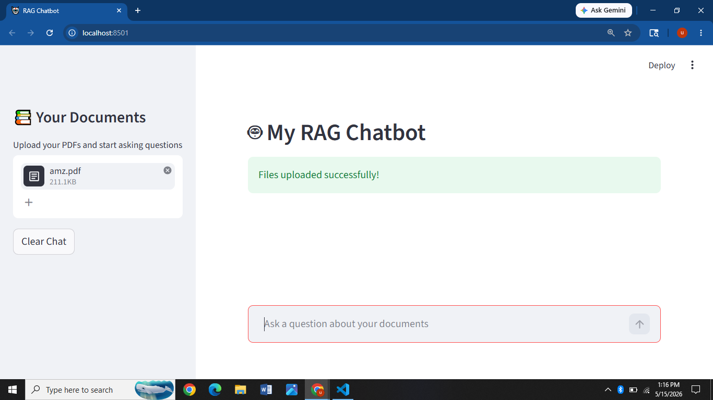
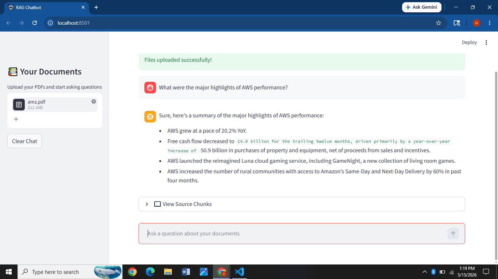
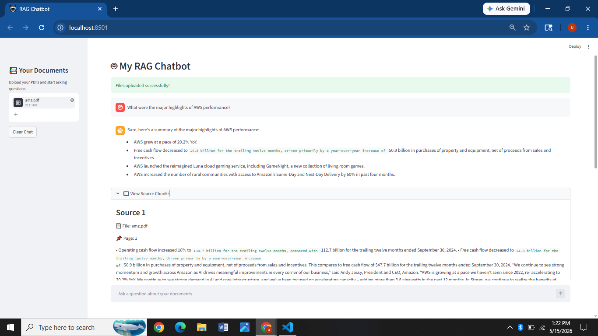

````md
# 🤖 RAG Chatbot using Ollama + FAISS

A Retrieval-Augmented Generation (RAG) chatbot that allows users to upload PDF documents and ask questions based on the document content.

The chatbot extracts text from PDFs, splits it into chunks, generates embeddings using HuggingFace models, stores embeddings in a FAISS vector database, retrieves relevant chunks, and generates contextual answers using a local LLM through Ollama.

---

# 🚀 Features

- 📄 Upload PDF documents
- 💬 Ask questions from uploaded PDFs
- 🧠 Semantic search using embeddings
- ⚡ FAISS vector database for fast retrieval
- 🤖 Local LLM support using Ollama
- 🔍 Source chunk visualization
- 📚 Context-aware answers using RAG pipeline
- 🖥️ Interactive Streamlit UI
- 🆓 Completely free and local setup

---

# 🛠️ Tech Stack

- Python
- Streamlit
- LangChain
- FAISS
- HuggingFace Embeddings
- Ollama
- pdfplumber

---

# 🧠 RAG Architecture

```text
PDF Document
     ↓
Text Extraction
     ↓
Text Chunking
     ↓
Embeddings Generation
     ↓
FAISS Vector Store
     ↓
Retriever
     ↓
Prompt + Context
     ↓
LLM (Gemma via Ollama)
     ↓
Final Response
```

---

# 📷 Screenshots

## 🏠 Chatbot Home



---

## 💬 Chatbot Response



---

## 🔍 Source Chunk Retrieval



---

# 📦 Installation

## 1️⃣ Clone Repository

```bash
git clone YOUR_GITHUB_REPO_LINK
cd rag-chatbot
```

---

## 2️⃣ Create Virtual Environment (Optional)

```bash
python -m venv venv
```

### Activate Environment

#### Windows

```bash
venv\Scripts\activate
```

#### Mac/Linux

```bash
source venv/bin/activate
```

---

## 3️⃣ Install Requirements

```bash
pip install -r requirements.txt
```

---

# 🦙 Install Ollama

Download Ollama from:

https://ollama.com

---

# ⬇️ Pull Gemma Model

```bash
ollama pull gemma:2b
```

---

# ▶️ Run the Chatbot

```bash
streamlit run RagChatbot.py
```

---

# 📄 Supported File Type

- PDF

---

# 📚 Concepts Used

- Retrieval-Augmented Generation (RAG)
- Embeddings
- Vector Databases
- Semantic Search
- Chunking
- Prompt Engineering
- Local LLMs
- Similarity Search

---

# 🔍 How It Works

1. User uploads a PDF
2. Text is extracted using pdfplumber
3. Text is split into chunks
4. Embeddings are generated using HuggingFace model
5. Embeddings are stored in FAISS vector DB
6. User asks a question
7. Retriever fetches relevant chunks
8. Context + question sent to Gemma LLM
9. Final answer displayed in Streamlit UI

---

# 📁 Project Structure

```text
rag-chatbot/
│
├── screenshots/
├── sample_pdfs/
├── .gitignore
├── README.md
├── RagChatbot.py
└── requirements.txt
```

---

# 📌 Future Improvements

- Multi-PDF support
- Chat history memory
- Hybrid search
- Metadata filtering
- Authentication
- Streaming responses
- Cloud deployment
- Better UI/UX

---

# 🙌 Acknowledgements

- LangChain
- HuggingFace
- Ollama
- Streamlit
- FAISS

---

# 👨‍💻 Author

Upasana

AI/ML & Data Analytics Enthusiast
````
